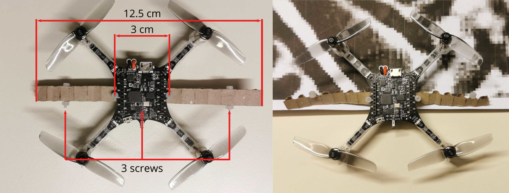

# Kidnapping Deep Learning-based Multirotors using Optimized Flying Adversarial Patches

## Installation
### Clone the repository
To clone the repository including the code from the PULP-Frontnet module, use this command:
```bash
# via ssh
$ git clone --recurse-submodules git@github.com:phanfeld/flying_adversarial_patch.git
# or via https
$ git clone --recurse-submodules https://github.com/phanfeld/flying_adversarial_patch.git
```

If you have cloned the repository without the `--recurse-submodules` argument and want to pull the PULP-Frontnet code, please use the following command inside the repository:
```bash
$ git submodule update --init --recursive
```
### Download the datasets
For downloading the datasets:
```bash
$ cd pulp-frontnet/PyTorch
$ curl https://drive.switch.ch/index.php/s/FMQOLsBlbLmZWxm/download -o pulp-frontnet-data.zip
$ unzip pulp-frontnet-data.zip
$ rm pulp-frontnet-data.zip
```
The datasets should now be located at `pulp-frontnet/PyTorch/Data/`.

### Setting up a Python Virtual Environment and installing needed Python packages
To install all of the needed Python packages, you can use the provided `requirements.txt` file. To avoid messing with packages you need for other projects, you can set up a Python Virtual Environment. To do so, execute the following commands.
```bash
$ python3 -m venv /path/to/env
$ source path/to/env/bin/activate
$ python -m pip install -r path/to/flying_adversarial_patch/requirements.txt
```

## Compute adversarial patches and their positions
To generate the adversarial patch with optimal transformation matrices, you can call
```bash
$ python src/attacks.py --file settings.yaml
```
Please adapt the hyperparameters in `settings.yaml` in the main folder according to your needs.
### Choosing the optimization approach
Please change the optimization approach in the `settings.yaml` file to your desired mode. You can choose between `'fixed'`, `'joint'`, `'split'`, and `'hybrid'`.
```yaml
mode: 'split' # 'fixed', 'joint', 'split', 'hybrid'
```
### Setting target positions
For setting multiple desired target positions $\bar{\mathbf{p}}^h_K$, change the values in `settings.yaml` for the targets like so:
```yaml
  x : [1.0, 0.5]
  y : [-1, 1]
  z : [0, null]
```
Now, the patch will be optimized for two targets: $\bar{\mathbf{p}}^h_1 = (1, -1, 0)^T$, $\bar{\mathbf{p}}^h_2 = (0.5, 1, z)^T$. For the second target, the attack does not set the $z$-value to a desired one but tries to keep it to the originally predicted $z$ in $\hat{\mathbf{p}}^h$ for the current image.
### Starting from different initial patch
You can change the initial patch for a training run in the settings file. Either set
```yaml
patch: 
  mode: 'face'
  path: 'src/custom_patches/custom_patch_96x160.npy'
```
to, e.g., start from a patch showing a face. Please specify the path to point to a valid numpy array file. The patch should be grayscale and have the same resolution as the base images.

If the initial patch should be white or starting from random pixel values, adapt the patch mode in the `settings.yaml` like:
```yaml
patch: 
  mode: 'white'
```
or 
```yaml
patch: 
  mode: 'random'
```
### Results
All results will be saved at the specified path in the `settings.yaml`.\
The folder will contain the following files:
```
path
|_settings.yaml # a copy of the settings.yaml
|_patches.npy   # a numpy array containing all patches
|_positions_norm.npy # the optimized positions for the K targets
|_positions_losses.npy # all computed losses for the positions
|_patch_losses.npy # all computed losses for the current patch
|_losses_test.npy # the loss on the entire testset after each iteration
|_losses_test.npy # the loss for the entire trainset after each iteration
|_boxplot_data.npy # an array containing all of the data needed to create the boxplots from the paper
```
## Reproduce the experiments of the paper
To reproduce all of the results from the paper "Flying Adversarial Patches: Manipulating the Behavior of Deep Learning-based Autonomous Multirotors" and "Kidnapping Deep Learning-based Multirotors using Optimized Flying
Adversarial Patches" we prepared several scripts:
### Comparison between the different approaches
To run the full experiment on the different approaches, run:
```bash
$ python src/exp1.py --file exp1.yaml -j 4 --trials 10 --mode all
```

Please adapt the hyperparameters in the `exp1.yaml` file according to your needs. 

With `-j 4`, 4 worker processes are spawned and all approaches are computed in parallel. Depending on your hardware, you can set `-j` to a different value. If `-j` is set to 1, the different approaches will be computed consecutively.

With `--trials 10` you can set the number of parallel training runs for the same mode to 10 like we did in the paper.

With `--mode all` you can choose all modes ('fixed', 'joint', 'split', 'hybrid'). You can additionally set the mode to one or a combination of all modes with, e.g., `--mode fixed hybrid` to only run the experiment for the 'fixed' and 'hybrid' approach.

The resulting mean test loss for all optimization approaches will be printed in the terminal.\
The results folder will contain a PDF file including the boxplots (among others) similar to Fig. 3 and 4 from the paper.

### Scalability for multiple target positions
To run the experiment on $1\leq K \leq 10$ desired target positions $\bar{\mathbf{p}}^h_K$, run:
```bash
$ python src/exp2.py --file exp2.yaml -j 4 --trials 10
```

Please adapt `exp2.yaml` according to your needs. Note that the mode needs to be changed in the yaml file! Setting the mode with the `--mode` argument is not possible (currently).

The resulting mean test loss for all $K$ will be printed in the terminal.\
The results folder will contain a PDF file including a plot similar to Fig. 5 from the paper.

### Comparison of different starting patches
You can reproduce the experiment by analyzing different starting patches with executing:
```bash
$ python src/exp3.py --file exp3.yaml -j 4 --trials 10 --mode all
```

Please adapt `exp3.yaml` according to your needs.

The resulting mean test loss for all patch modes and optimization approaches will be printed in the terminal.

### Analysing the impact on the quantized NN
We analyzed the impact of the adversarial patches calculated for the full-precision version of PULP-Frontnet to the ones calculated for the quantized version of Frontnet.

You can start the optimization of the patches for the quantized NN with:
```bash
$ python src/exp4.py --file exp4.yaml -j 4 --trials 10 --mode all
```

This script will also load previously calculated patches from a specified evaluation folder and calculate the test loss on the quantized NN. Before running the script, you therefore need to adapt the path of the folder in which those patches are saved in [here](src/exp4.py#L60).


## Reproduce camera calibration
To reproduce the camera calibration, we gathered images of a checkerboard pattern with our adapted code of the [wifi-img-streamer example](https://github.com/phanfeld/aideck-gap8-examples) originally provided by Bitcraze [here](https://github.com/bitcraze/aideck-gap8-examples).

We adapted the code provided in [this repository](https://github.com/IMRCLab/cv-mrs/) to calculate the camera intrinsic and extrinsic parameters and the distortion coefficients by calling:
```bash
$ python misc/opencv_calibration_intrinsic.py /path/to/checkerboard_images/

$ python misc/opencv_manual_extrinsic.py misc/calibration.yaml
```
## Hardware
### Prerequisites:
* [Crazyflie 2.1](https://store.bitcraze.io/products/crazyflie-2-1)
* [Crazyradio PA 2.4 GHz](https://store.bitcraze.io/products/crazyradio-pa)
* [AI Deck 1.1](https://store.bitcraze.io/products/ai-deck-1-1?variant=32485907890263)
* [Upgraded motors and propellers](https://store.bitcraze.io/collections/accessories/products/thrust-upgrade-bundle-for-crazyflie-2-x?variant=40029196419159)
* JTAG Debugger with 10-pin-connector
* Gamepad/Controller (e.g. XBox 360 USB Controller)
* [Install Crazyflie Client](https://www.bitcraze.io/documentation/repository/crazyflie-clients-python/master/installation/install/)
* [Install docker](https://docs.docker.com/desktop/install/ubuntu/)
* [Install ros2 galactic](https://docs.ros.org/en/galactic/Installation.html)

For flying, the UAVs need to be aware of their current state estimates. This information is either provided through a motion capture system or the [Crazyflie FlowDeck v2](https://store.bitcraze.io/collections/decks/products/flow-deck-v2). State estimates provided by the FlowDeck are most likely more inaccurate than the pose information provided by a motion capture system.

### [Crazyswarm 2](https://imrclab.github.io/crazyswarm2/index.html)
For improved control of the UAVs, we'll utilize Crazyswarm 2.
#### Install dependencies:
```bash
$ sudo apt install libboost-program-options-dev libusb-1.0-0-dev
$ python -m pip install rowan 
# install python package rowan into your current python environment 
```
#### Set up your ros2 workspace:
Create a ros2 workspace. For ease of use, this folder can be placed in e.g. your home directory.
```bash
$ mkdir -p path/to/ros2_ws/src
$ cd path/to/ros2_ws/src
$ git clone https://github.com/IMRCLab/crazyswarm2 --recursive
$ git clone --branch ros2 --recursive https://github.com/IMRCLab/motion_capture_tracking.git
```
Additionally, the ros2 package provided with this repository needs to be accessible in the `ros2_ws/src` folder. Therefore, create a symbolic link:
```bash
$ ln -s path/to/flying_adversarial_patch/hardware/frontnet_ros path/to/ros2_workspace/src
```
Please make sure to use the full path instead of relative paths to avoid issues with linking.\
Now build all of the packages:
```bash
$ cd ../ # go back to path/to/ros2_ws/
$ colcon build --symlink-install
```

### Attacker firmware
The firmware for the victim will be flashed wirelessly via the Crazyradio. Please power the Crazyflie via a battery or use the USB connector.\
As a prerequisite, we need the address of the Crazyflie. If not set manually, the standard address is `radio://0/80/2M/E7E7E7E7E7`. The address can be set easily with the [Crazyflie Client](https://www.bitcraze.io/documentation/repository/crazyflie-clients-python/master/userguides/userguide_client/#firmware-configuration).
For example, our attacker Crazyflie's address is `E7E7E7E712`.

Now move to the correct folder, build, and lastly flash the firmware with the following commands:
```bash
$ cd path/to/flying_adversarial_patch/hardware/attacker_firmware/
$ make cf2_defconfig
$ make -j
$ cfloader flash cf2.bin stm32-fw -w radio://0/80/2M/E7E7E7E7E7
```

### Victim firmware
Similarly to the attacker, the victim Crazyflie's address can be set manually. We set the address of our victim Crazyflie to `E7E7E7E707`. 

The victim's firmware can be flashed as follows:
```bash
$ cd path/to/flying_adversarial_patch/hardware/frontnet_controller/
$ make -j
$ cfloader flash ../crazyflie-firmware/cf2.bin stm32-fw -w radio://0/80/2M/E7E7E7E7E7
```

### AI deck GAP8 Firmware (only needed for victim UAV)
To flash the quantized Frontnet network and adapted GAP8 firmware to the GAP8 of the AI deck, connect the JTAG Debugger to the corresponding pins of the GAP8 and via USB to your PC. Please attach the AI deck to the Crazyflie, such that it is powered either through the attached battery or the USB connector.

Then flash the code as follows:
```bash
$ cd path/to/flying_adversarial_patch/hardware/frontnet_code/
$ docker run --rm -v ${PWD}:/module --device /dev/ttyUSB0 --privileged -P bitcraze/aideck /bin/bash -c 'export GAPY_OPENOCD_CABLE=interface/ftdi/olimex-arm-usb-tiny-h.cfg; source /gap_sdk/configs/ai_deck.sh; cd /module;  make clean all'
```
Please make sure that your JTAG device is `/dev/ttyUSB0`, otherwise please change the command accordingly with the correct number.

### Fly with Crazyswarm 2 and Frontnet
After successfully flashing of both attacker and victim, you can start your flight tests.\
If you are utilizing the FlowDeck for state estimates, make sure it is connected to the bottom of your Crazyflies. Otherwise, make sure that your motion capture system is running and that you have configured Crazyswarm 2 correctly to receive pose information (e.g. adapt `motion_capture.yaml` in the `hardware/frontnet_ros/config` folder to match your setup).

You'll need at least one terminal window opened in your ros2 workspace.
```bash
$ cd path/to/ros2_ws/
# additional sourcing needed to prepare ros2
$ source /opt/ros/galactic/setup.bash
$ . install/local_setup.bash
$ ros2 launch frontnet_ros launch.py
```
After a few seconds, you'll be able to take off by pressing the Start button on the Xbox controller. To enable the Frontnet network output to be used to generate new setpoints, press the X button and move in front of the camera.

## Kidnapping the victim Crazyflie
### Preparing the flying patches
To reproduce the experiments of our supplemental video, you first need to prepare the adversarial patches for printing and save the assignment and optimized positions.
We provided a script that can be called with:
```bash
$ python src/demo_prep.py eval/demo/multi/
```
If you used our `settings.yaml` to optimize the adversarial patches, the results will be saved at `eval/demo/multi/`. Otherwise, just adapt the path to your result folder accordingly.

This script will create a PDF file of all patches and save the assignment and the optimized positions in `results.yaml` inside the `eval/demo/multi/` folder. The `results.yaml`is also saved in the main folder of this repository for convenient use by our attack policy script.

You can print the patches onto a regular A4 paper. Please cut off the white borders to the left, right, and bottom. Keep at least 0.5 cm of the top border, since the paper needs to be attached to the Crazyflie.

### Attaching the patches to the victim


For attaching the printed patches, we cut out a 12.5 cm long, thin piece of cardboard, as displayed in the image above. To secure the cardboard to the Crazyflie, we cut two 2.5 mm diameter holes 3 cm apart from each other into it.

To secure the paper to the cardboard, we cut 3 holes into the top part, one in the middle and two to the sides. The hole in the middle should go directly underneath the center of the Crazyflies. We use lightweight 2.5 mm diameter screws to attach paper and cardboard onto each other and the Crazyflie.

Our attack policy assumes that patch 0 is facing in the direction of the USB connector and patch 1 is facing in the direction of the small tip next to the power button.

### Running the attack policy script
After opening a terminal and launching the Crazyswarm server as described [previously](README.md#fly-with-crazyswarm-2-and-frontnet), open a second terminal window and launch our attack script with
```bash
$ cd path/to/flying_adversarial_patch/hardware/frontnet_ros/
$ source path/to/env/bin/activate
$ source /opt/ros/galactic/setup.bash
$ . install/local_setup.bash
$ python frontnet_ros/attack.py
```

We provide two desired trajectories with this repository:\
1) Moving along a straight line in y direction (as seen in the second and third clip in the video).
2) Capturing the victim inside the net (as seen in the last clip in the video).

Both trajectories are stored in `hardware/frontnet_ros/data/movey.csv` and `hardware/frontnet_ros/data/capture.csv` respectively. They were generated using the [UAV Trajectories](https://github.com/whoenig/uav_trajectories.git) repository.

To change which experiment you currently want to run, please adapt the path to the trajectory csv file [here](hardware/frontnet_ros/frontnet_ros/attack.py#177) in the attack script.

The take-off and initial positioning for both Crazyflies will be done by the attacker script.

You are only required to enable the Frontnet network output to be used to generate new setpoints as soon as both drones are at their initial positions. 

For the victim that means that it is turned by yaw = -90° and hovering, for the attacker that means that it is positioned in proximity to the victim and in the field of view of the AI deck camera. You can then press the X button on the Xbox controller to enable Frontnet on the victim drone.
